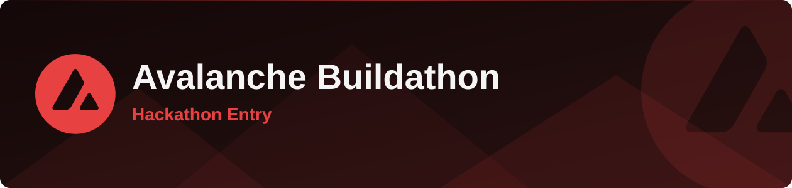
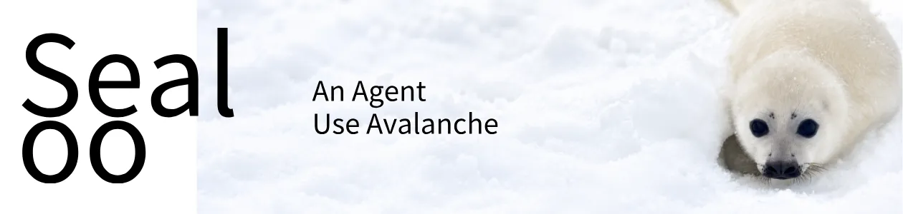
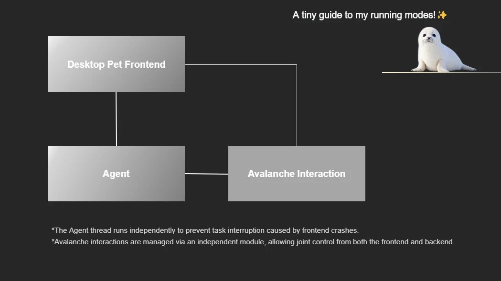

<div align="left">

<h1 align="left">🦭Sealoo</h1>

Your AI seal on the desktop.

## ✨Adopt the seal

You will receive

1. A simple Avalanche experience
2. A cute seal
3. An Agent
4. A permanent pet with an identity
5. A simpler entrance to Avalanche

## 📸Demo


## 🛠️Tech stack

**Desktop:** Tauri 2, TypeScript, Vite, Three.js, viem

**Agent:** Go

**Contracts:** Solidity, Foundry

## Architecture



## 📁Project structure

```text
Sealoo/
├── app/                 # Tauri desktop client
│   ├── src/             # TypeScript UI, movement, web3
│   ├── src-tauri/       # Rust shell, prefs, agent bridge
│   ├── index.html       # Pet window
│   └── home.html        # Home window
├── agent/               # Go agent runtime
│   ├── main.go
│   └── runtime/
├── web3/                # Solidity + Foundry
│   ├── src/             # AgentRegistry, WorkCredit
│   ├── script/
│   └── test/
├── model/               # Blender models & export
├── docs/                # Product docs
└── github_public/       # README assets
```

</div>
